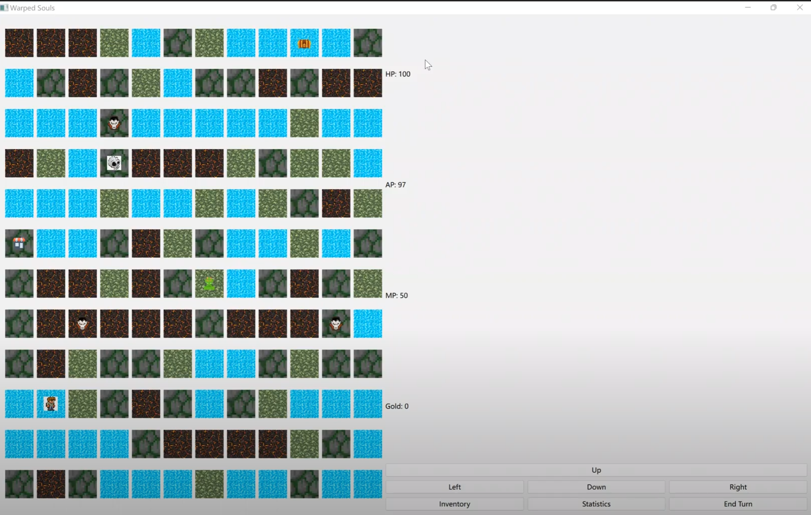
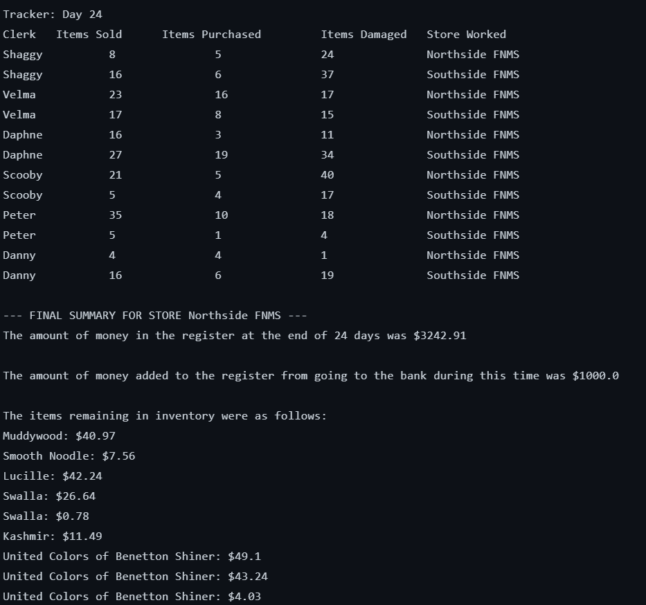
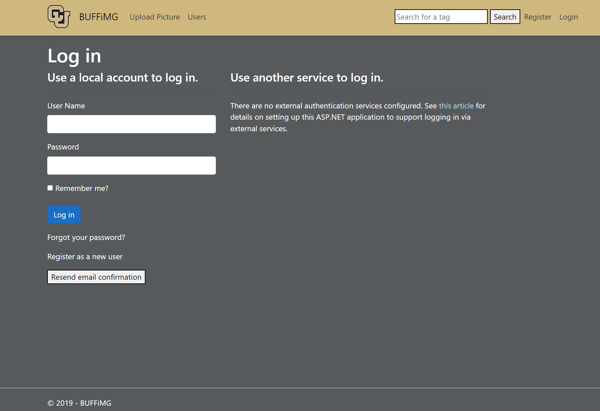



## *[NewsMe](https://github.com/akitomoya616/NewsMe)* (Android Application)
May 2022 - Present

- An Android application demo (constructed primarily in `Java`) built through independent learning 
- Implemented a variety of different functions that were practiced while self-learning, including navigation drawer menu, scrollable page, decorator outer frame, and API references. Aiming to add more features in the future
- Weather page accesses the user's location info and grabs weather info corresponding to the location using JSON file accessed using weather api to display today's weather and weather forecast

 

Weather Demo (takes a little time to get geographical access for the first time)

## *[Warped Souls](https://github.com/addzy94/ooad-project-game)* (Qt Board Game)
March 2022 - May 2022

- A 2D dungeon game developed using `Qt` with `Pyside` and was applied with Object-oriented principle
- Each enemy (created using Factory Pattern) in the game can move in a unique logic (created using Strategy Pattern)
- Player can move his/her avatar around on the board (created using Singleton Pattern) by pressing the corresponding direction buttons (implemented using Command Pattern)
- Each action of a character on the board is recorded in the text box (implemented using Observer Pattern)
- [Recorded demo can be found here](https://drive.google.com/file/d/1pUlaC-z9wJE8GCpSlfkP2MKJSoyO0tnB/view?usp=sharing)

## *[Music Store Simulator](https://github.com/addzy94/ooad-project-team)* (Object-Oriented Demo) 
Jan 2022 - Mar 2022

- A `Java` based (Object-oriented principle applied) simulator operates two automated stores (generated using Abstract Factory Pattern) for 30 days
- Automated daily tasks include clearing inventory, withdrawing cash, and selling or buying merchandise from customers. The user can play as a customer and shop in store by entering commands in the command line (implemented using Command Pattern)
- Each product sold or acquired can generate a preferential sales/resale price by being tied to a specific product (implemented using Decorator Pattern)
- The daily actions of the store staff are recorded in the logger file (created using Observer Pattern)

## *[Dark Souls Simulator](https://github.com/akitomoya616/Souls-Game)* (OpenGL Project) 
Oct 2021 - Dec 2021

- An Indie demo of a 3D first-person perspective game developed using `OpenGL` for the first time
- Contains souls-like UI, transparent objects, sky box, collision detection, lighting effects produced by a slightly modified shader, and illusory walls with animated textures. Managed to mimic the game scenario experienced in traditional Souls games
- [Recorded demo can be found here](https://drive.google.com/file/d/1i8sZmz35qDkBEU3uEd2EGe5iPiT1X4QQ/view?usp=sharing)

Screenshot in game

Gif demo (quality of the recorded Gif demo is a bit low)
 

## *[BUFFiMG](https://github.com/SamFeig/BUFFiMG)* (Web with Database) 
Oct 2019 - Dec 2019

- A `HTML` website hosted on Heroku where users can log in with a registered account, upload and sort photos by tags
- Semester-long project for a group of six. Mainly responsible for front-end web design and rough algorithms for back-end database access and storage mechanism (add/delete/modify/search user pictures with tags using `SQL` database)

